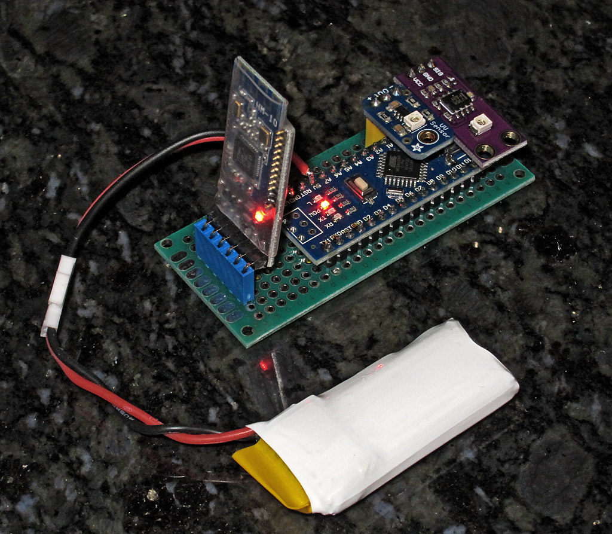
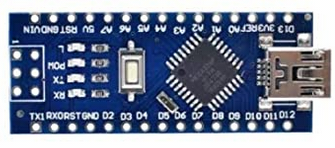
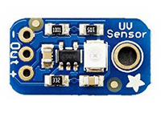
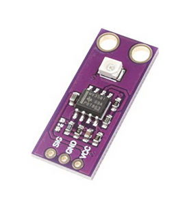
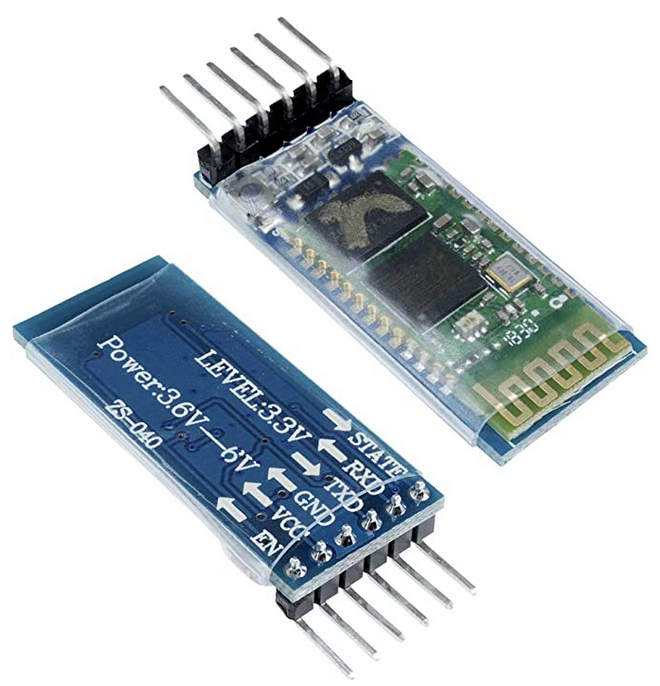
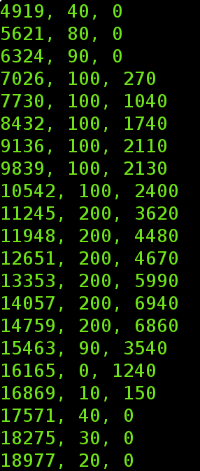
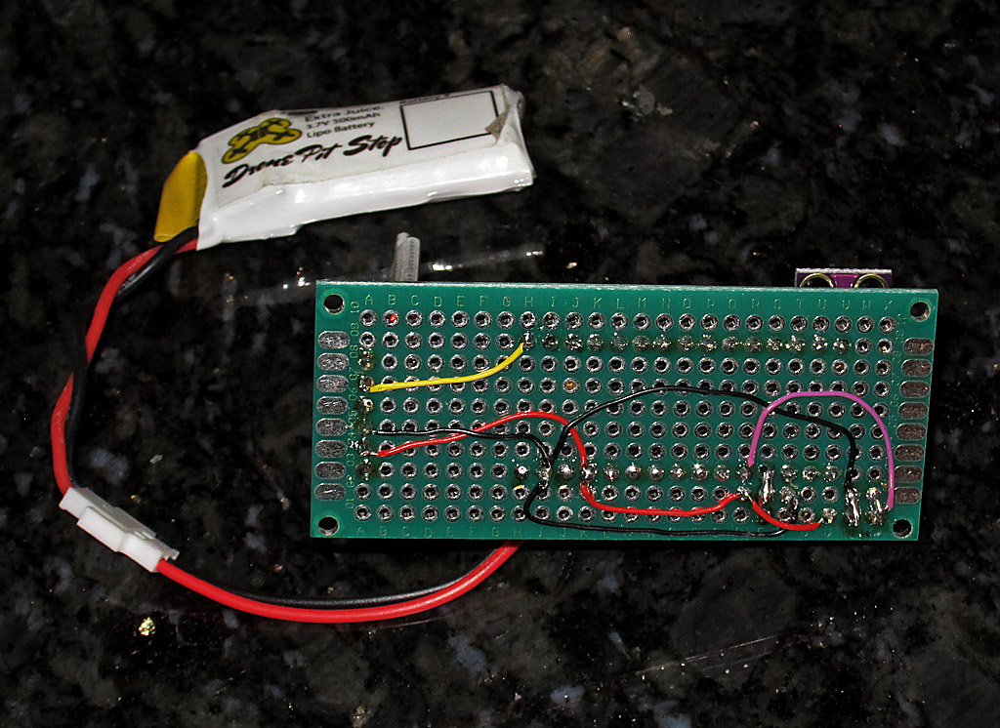
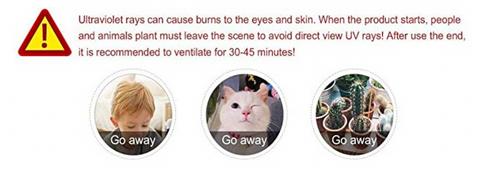
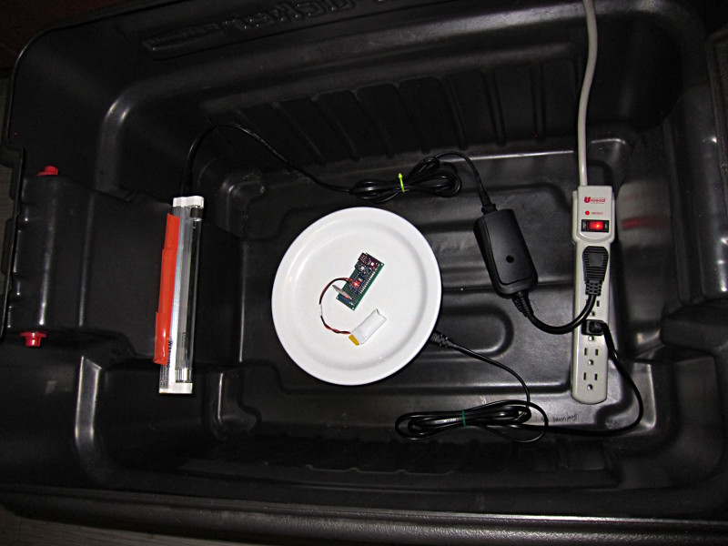

# UVSee

Ultra-violet Light Sensor (Arduino, Bluetooth, Serial)

A simple wireless and battery operated UV sensor module.  One possible use is to detect the presence of UV light (including UV-C) inside a disinfection chamber (ie, a light-sealed opaque box).  The UV-C radiation is harmful to skin, eyes and so it must be inside a sealed enclosure.  Exposure is set via a timer, typically a few minutes to an hour.  During that interval, it is useful to know if the UV-C light *actually* operational during that (light) soak time.  Since you are not allowed to look inside the box when the light is turned on, the UV dector is needed to confirm correct operation for the duration of the exposure.

## Parts Needed

Implemented using easily-available parts:
- **Arduino Nano**
- **guva-s12sd** UV sensor (analog voltage-based)
- **hc-05** or **hm-10** bluetooth serial modules
- **lipo battery** 4.2v rechargeable (hobby quadcopter, etc)

## Application

The arduino nano module:

two of the guva-s12sd sensors:

and the bluetooth module:

are all mounted on a single general-purpose perf board, with wire-wrap wires used for a one-off prototype build.

Power is supplied by a 3.7-4.2v lithium poly battery.  These are commonly used for "hobby drones"; they are cheap and charges are easily available.  To keep the sensor board smaller, no charging circuit was included.

## Serial Data Stream

The bluetooth modules (hc-05 for bluetooth classic, or hm-10 for BLE) allow and easy and OS-independant way to have a "wireless serial connection" between 2 systems.  The arduino sensor module and its BT transmitter is the data sender, while a matching BT receiver is connected to a USB/serial cable such as FTDI, pl2303, cp2102 or equiv.  Speed is not critical as the data payload is very short (timestamp, sensor1_value, sensor2_value).  Simple ASCII is used to allow ease of viewing (even on android/apple phones using a BT terminal app).

### Sample output:

# Sensor Redundancy

Two vendor modules were purchased, just to have variety and some redundancy.  As it turns out, the two modules have different gains or sensitivities and we can use that for some diversity averaging.  Modules were sourced from Amazon; here are sample links:

- https://www.amazon.com/gp/product/B07VX6DTJT
- https://www.amazon.com/gp/product/B00LEVTOB0

# Schematic & Board Layout

Currently, there is no custom PCB; but here is a bottom view of the hand-made board, for reference:

For reference, the BT module is on the far left (yellow, black, red wires going to it) and the two sensors are on the bottom/right of the photo.  Red is always 5v, black is always ground and purple is one of the sensor analog-out lines; this goes to arduino A2 analog input.  The other sensor has a very short direct 'bend-over' lead connection to the A0 input of the arduino.  The BT serial module is connected to 5v and ground and the yellow wire is the data-out (9600 serial TTL) from the Tx line on the standard arduino UART going to the Rx line on the bluetooth module.  Pinout is the same for hc-05 and hm-10.  Note, some setup is needed to auto-pair a set of BT modules.  Here is a good link for info about that: 

http://www.martyncurrey.com/hm-10-bluetooth-4ble-modules/

# Source Code

Arduino code is here: [uvsee_01.ino](uvsee_01.ino)

# Prototype UV-C Chamber

## First, a note from our sponsor...

(This was from an amazon.com advertisement.  I guess it gets the point across, LOL.)

Now that the *kids, kats and kactus* has left the room, we can continue...

## First Box Build

A very ugly - yet functional - opaque box to hold the minimal parts:

Far left is the fluorescent style UVC bulb and fixture.  Its just taped to the wall of the box, for now.  (Many more lights are planned, and they will be properly mounted).   The AC cord is connected to an RF wireless remote control relay; this will let me turn the light on and off with the box covered (so its safe; remember, you do not want to look at the light while its in operation!).  The white plate is sitting on a motorized turntable that spins slowly.  All these are connected to a power strip.  The sensor module is alone on the plate, but it would share space with the items to be disinfected.  Later, the module will be in its own 3d printed small enclosure.

